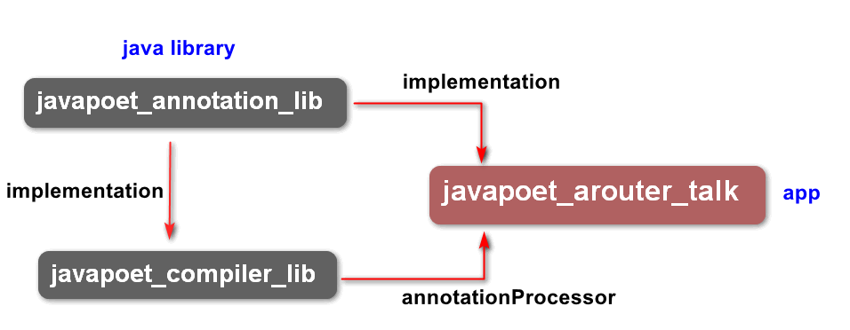

# AndIOCTalk
IOC相关

#### 仿黄油刀 BufferKnife 控件注入，分别使用传统的apt方式 和 javapoet的方式实现


    工程结构如下图所示：



    生成代码文件模板：

    ```java

     public class MainActivity$JViewBinder implements JViewBinder<MainActivity> {
         @Override
         public void bind(final MainActivity target) {
             target.tv = target.findViewById(2131231118);
             target.findViewById(2131231118).setOnClickListener(new JDebouncingOnClickListener() {
                 public void doClick(View view) {
                     target.clickit(view);
                 }
             });
         }
     }

    ```
